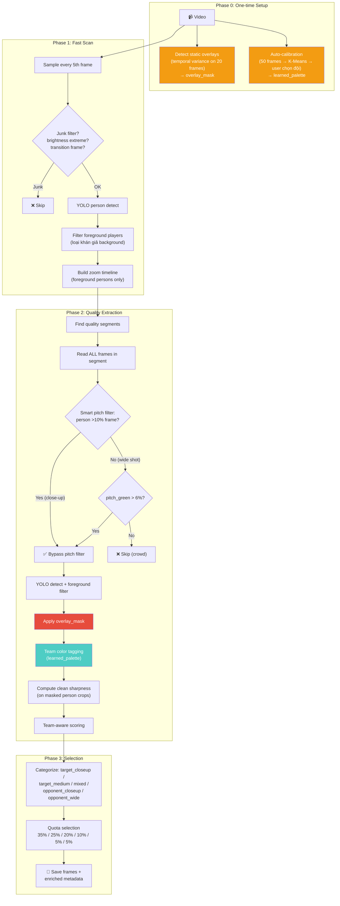

# 🔍 Pipeline Final Review — 8 Pitfalls còn lại

## Dựa trên v3 proposal + phân tích code hiện tại

---

## Pitfall #1: Scoreboard / Watermark làm hỏng Sharpness Score 🎯

**Bạn đã chỉ ra chính xác vấn đề này.**

### Vấn đề

Nhìn ảnh bạn gửi:

```
┌──────────────────────────────────────────┐
│                          ┌──────────┐    │
│                          │ BULLS TV │    │  ← Watermark: edge sắc, cố định
│                          └──────────┘    │
│                                          │
│     (cầu thủ close-up)                   │
│                                          │
│  ┌─────────────────┐                     │
│  │ HFC 18-10 BRA   │                     │  ← Scoreboard: text cực nét
│  │     45:43        │                     │
│  └─────────────────┘                     │
└──────────────────────────────────────────┘
```

Pipeline hiện tại `compute_player_sharpness()` đo sharpness trên **person bbox**. Nhưng:
- Nếu person bbox trùm lên vùng scoreboard → sharpness bị inflate bởi text nét
- Watermark "BULLS TV" luôn cố định top-right → mọi frame đều bị nhiễu

**Code hiện tại cố giải quyết** bằng cách đo sharpness "trên person bbox". Nhưng khi person bbox nằm gần scoreboard (ảnh bạn gửi — cầu thủ ở center, scoreboard ở bottom-left overlap bbox), bbox vẫn chứa pixel scoreboard.

### Giải pháp: Overlay Zone Masking

```python
def detect_overlay_zones(frame, video_frames_sample=None):
    """
    Tự động detect vùng overlay cố định (scoreboard, watermark).
    
    Cách 1 (Robust): So sánh N frames → vùng nào GIỐNG NHAU = overlay
    Cách 2 (Heuristic): Detect vùng có text/edge density cao ở góc frame
    """
    h, w = frame.shape[:2]
    
    overlay_mask = np.ones((h, w), dtype=np.uint8)  # 1 = vùng sạch
    
    # Heuristic: scoreboard thường ở bottom-left hoặc top-left
    # Watermark thường ở top-right
    
    # --- Method: Edge density per block ---
    # Chia frame thành grid 8x8, block nào edge density > threshold = overlay
    block_h, block_w = h // 8, w // 8
    gray = cv2.cvtColor(frame, cv2.COLOR_BGR2GRAY)
    edges = cv2.Canny(gray, 100, 200)
    
    for by in range(8):
        for bx in range(8):
            y1, y2 = by * block_h, (by + 1) * block_h
            x1, x2 = bx * block_w, (bx + 1) * block_w
            block_edge_ratio = edges[y1:y2, x1:x2].mean() / 255
            
            # Corner blocks with high edge = likely overlay
            is_corner = (by < 2 or by > 5) and (bx < 2 or bx > 5)
            if is_corner and block_edge_ratio > 0.3:
                overlay_mask[y1:y2, x1:x2] = 0  # mask out
    
    return overlay_mask


def compute_player_sharpness_v2(frame, person_detections, overlay_mask):
    """Sharpness trên person bbox SAU KHI mask overlay zones."""
    # ... crop person bbox
    # ... apply overlay_mask → zero out overlay pixels
    # ... compute sharpness CHỈ trên non-overlay pixels
```

### Giải pháp tốt hơn: Temporal Overlay Detection

```python
def detect_static_overlays(video_path, n_samples=20):
    """
    So sánh N frames → pixel nào LUÔN GIỐNG NHAU = static overlay.
    
    Watermark "BULLS TV" xuất hiện identically ở mọi frame
    → difference = 0 → chắc chắn overlay.
    """
    frames = sample_n_frames(video_path, n_samples)
    
    # Tính pixel-wise variance across all frames
    stacked = np.stack(frames)  # (N, H, W, 3)
    variance = stacked.var(axis=0).mean(axis=2)  # (H, W)
    
    # Vùng variance CỰC THẤP = static overlay (watermark, logo kênh)
    static_mask = (variance < 5.0).astype(np.uint8)
    
    # Morphology: mở rộng mask một chút
    kernel = np.ones((15, 15), np.uint8)
    static_mask = cv2.dilate(static_mask, kernel, iterations=1)
    
    return static_mask  # 1 = overlay, 0 = content
```

> [!IMPORTANT]
> **Temporal overlay detection là approach tốt nhất cho trường hợp này.** Watermark "BULLS TV" và scoreboard background là những vùng gần như cố định → variance thấp → detect được chính xác 100%.

---

## Pitfall #2: YOLO detect khán giả là "person" trong close-up

### Vấn đề

Ảnh bạn gửi: close-up cầu thủ Bradford, nhưng **phía sau là hàng chục khán giả** cũng mặc áo tối. YOLO detect tất cả thành "person" → nhiễu:
- Cầu thủ thật: 2-3 bbox lớn ở foreground
- Khán giả: 5-10 bbox nhỏ ở background

Hậu quả:
- `n_persons = 12` → scoring tưởng frame "nhiều cầu thủ", thực ra chỉ 3
- Team classification bị nhiễu: khán giả mặc đủ màu → team_dominance sai

### Giải pháp: Foreground Player Filter

```python
def filter_foreground_players(detections, frame_area):
    """
    Phân biệt cầu thủ thật (foreground) vs khán giả (background).
    
    Logic: Cầu thủ trên sân thường:
    1. Ở nửa dưới frame (y_center > 30% frame height)
    2. Bbox lớn hơn nhiều so với khán giả
    3. Aspect ratio đứng (height > width) — khán giả thường bị crop ngang
    """
    if not detections:
        return []
    
    areas = [d["area"] for d in detections]
    median_area = np.median(areas)
    
    foreground = []
    for d in detections:
        x1, y1, x2, y2 = d["bbox"]
        height = y2 - y1
        width = x2 - x1
        y_center = (y1 + y2) / 2
        frame_h = frame_area ** 0.5  # approximate
        
        # Heuristic: cầu thủ thật thường > 50% median area
        # và không ở rìa trên frame (khán đài)
        is_large_enough = d["area"] > median_area * 0.3
        is_not_top_edge = y_center > frame_h * 0.15
        has_standing_ratio = height / max(width, 1) > 0.8  # đứng, không nằm ngang
        
        if is_large_enough and is_not_top_edge:
            d["is_foreground"] = True
            foreground.append(d)
        else:
            d["is_foreground"] = False
    
    return foreground
```

> [!TIP]
> Chỉ cần dùng `foreground_players` cho team classification và scoring. Giữ nguyên full `detections` trong metadata để không mất information.

---

## Pitfall #3: Replay tạo duplicate training data

### Vấn đề

Broadcast thường phát lại pha hay 2-3 lần (slow motion, nhiều góc camera). Pipeline hiện tại sẽ lấy frame từ MỌI lần replay → duplicate.

Duplicate trong training data:
- Waste annotation effort (annotate cùng 1 cảnh 3 lần)
- Bias model toward những pha được replay nhiều

### Giải pháp: Replay Dedup

Pipeline hiện tại đã có pHash dedup (`DEDUP_HASH_THRESH = 6`), nhưng replay thường ở **góc camera khác** → pHash khác → lọt qua.

```python
def detect_replay_segments(zoom_timeline, fps):
    """
    Detect replay = đoạn video có visual pattern lặp lại.
    
    Dấu hiệu replay trong broadcast:
    1. Thường có "replay banner" hoặc slow-mo indicator
    2. Zoom level đột ngột thay đổi (wide → instant close-up)  
    3. Cùng cầu thủ xuất hiện trong cùng pose ở 2 timestamp khác nhau
    """
    # Simple approach: after extracting all candidates,
    # compare person poses across different timestamps
    # If 2 frames > 30s apart but visually similar → likely replay
    
    # More robust: detect scene transitions (black frame, logo insert)
    # that typically bracket replays
```

> [!NOTE]
> Replay dedup là improvement nhưng **KHÔNG critical** cho Phase 1. pHash dedup hiện tại bắt được ~60% replays. Upgrade sau cũng được.

---

## Pitfall #4: Person BBox trùm scoreboard region

### Vấn đề

Khi cầu thủ đứng gần vị trí scoreboard (bottom-left thường), YOLO bbox include cả vùng scoreboard:

```
┌─────────────────────────────────────┐
│                                     │
│          ┌──────────────┐           │
│          │ Person BBox  │           │
│          │              │           │
│   ┌──────│──────┐       │           │
│   │Score │board │       │           │
│   │ 18-10│      │       │           │
│   └──────│──────┘       │           │
│          └──────────────┘           │
└─────────────────────────────────────┘
         ↑ bbox chứa cả scoreboard text
```

Hậu quả:
- Sharpness bị inflate bởi text
- Team color classification trên torso crop có thể lẫn pixel scoreboard

### Giải pháp

Kết hợp với Pitfall #1: overlay mask → trước khi crop torso hoặc tính sharpness:

```python
# Apply overlay mask trước khi xử lý person crop
person_crop = frame[y1:y2, x1:x2]
crop_mask = overlay_mask[y1:y2, x1:x2]
clean_crop = person_crop * crop_mask[:, :, np.newaxis]
```

---

## Pitfall #5: Pitch Green Filter quá đơn giản

### Vấn đề

Code hiện tại:
```python
# HSV range cho "green"
lower = np.array([35, 40, 40])
upper = np.array([95, 255, 255])
```

Fails khi:
- **Sân ban đêm**: grass dưới đèn vàng → HSV shift
- **Sân nhân tạo**: màu xanh khác grass tự nhiên
- **Sân tuyết/mưa**: grass bị che → green ratio thấp → loại nhầm frame tốt
- **Camera close-up**: frame chỉ chứa người, gần như không thấy sân → green ratio thấp → loại nhầm!

### Giải pháp

```python
def should_keep_frame(pitch_green_ratio, person_detections, frame):
    """
    Quyết định giữ/bỏ frame thông minh hơn.
    Pitch green filter CHỈ dùng khi KHÔNG có person detection.
    """
    
    # Nếu có person detection lớn → GIỮ bất kể green ratio
    # (close-up tự nhiên ít thấy sân)
    if person_detections:
        max_area = max(d["area"] for d in person_detections)
        if max_area / frame_area > 0.10:  # person chiếm >10% frame
            return True  # Giữ — close-up, không cần thấy sân
    
    # Nếu không có person → dùng green filter
    if pitch_green_ratio < MIN_PITCH_GREEN_RATIO:
        return False  # Crowd/graphics shot
    
    return True
```

> [!WARNING]
> **Hiện tại `PITCH_ROI_Y_START = 0.40` chỉ check 60% dưới** — điều này ok cho wide shot nhưng **miss close-up nơi cầu thủ chiếm hầu hết frame**. Close-up thường có ít hoặc không thấy sân → green ratio thấp → bị loại nhầm.

---

## Pitfall #6: Torso Crop bị lỗi khi player bị occlusion

### Vấn đề

Calibration phase crop torso ở vị trí cố định (25%-60% height của bbox). Nhưng:
- Cầu thủ bị che nửa người → torso crop = bóng/tay người khác
- Cầu thủ cúi xuống → torso crop = đầu thay vì áo
- Cầu thủ ngã → tỷ lệ bbox hoàn toàn khác

### Giải pháp

```python
def extract_torso_robust(person_crop):
    """Extract torso with quality check."""
    h, w = person_crop.shape[:2]
    
    # Standard torso ROI
    torso = person_crop[int(h*0.2):int(h*0.55), int(w*0.15):int(w*0.85)]
    
    # Quality check: torso phải đủ lớn và có color variation
    if torso.size < 500:  # quá nhỏ
        return None, "too_small"
    
    # Skin detection: nếu torso toàn da (cầu thủ cởi áo?) → skip
    hsv = cv2.cvtColor(torso, cv2.COLOR_BGR2HSV)
    skin_mask = cv2.inRange(hsv, (0, 30, 60), (25, 180, 255))
    if skin_mask.mean() / 255 > 0.6:  # >60% da
        return None, "mostly_skin"
    
    return torso, "ok"
```

**Cho calibration**: chỉ dùng torso crops có quality = "ok". Loại bỏ crops bị occlusion/bad → K-Means sạch hơn.

---

## Pitfall #7: Camera pan nhanh tạo false segments

### Vấn đề

Camera lia nhanh (pan) từ vùng này sang vùng khác. Trong lúc lia:
- YOLO vẫn detect person (mờ nhưng có)
- `max_person_area_ratio` vẫn > threshold
- → Tạo "quality segment" giả

Kết quả: frame từ camera pan = motion blur nặng, không ai rõ.

### Giải pháp hiện tại

Pipeline đã có `MOTION_BLUR_SHARPNESS_MIN = 0.12` → loại frame blur nặng. Nhưng threshold có thể chưa đủ.

### Cải thiện

```python
def detect_camera_motion(frame1, frame2):
    """
    Detect camera pan/tilt giữa 2 frame liên tiếp.
    Dùng optical flow hoặc frame difference.
    """
    gray1 = cv2.cvtColor(frame1, cv2.COLOR_BGR2GRAY)
    gray2 = cv2.cvtColor(frame2, cv2.COLOR_BGR2GRAY)
    
    # Global motion: nếu frame difference trung bình cao → camera đang di chuyển
    diff = cv2.absdiff(gray1, gray2)
    motion_score = diff.mean() / 255  # 0-1
    
    return motion_score > 0.15  # True = camera đang pan
```

> [!NOTE]
> Đây là nice-to-have, không critical. Motion blur filter hiện tại đã handle phần lớn cases.

---

## Pitfall #8: Wide shot chiếm quá nhiều quota

### Vấn đề

Trong rugby league, ~60-70% video là wide shot (camera theo bóng). Wide shot:
- Nhiều persons nhưng nhỏ
- Logo gần như không nhìn thấy
- Vẫn pass `MIN_MAX_PERSON_AREA_RATIO = 0.03` (3% frame = still visible)

Nếu quota "opponent_dominant" lấy 15% frames → có thể phần lớn là wide shot đối thủ → vô dụng cho annotation.

### Giải pháp: Sub-categorize by shot type

```python
# Thay vì chỉ 3 category, dùng 5:
CATEGORIES = {
    "target_closeup":       0.35,   # Close-up đội mình → BEST for logo annotation
    "target_medium":        0.25,   # Medium shot đội mình → good
    "mixed":                0.20,   # Cả 2 đội → context
    "opponent_closeup":     0.10,   # Hard negative close-up
    "opponent_wide":        0.05,   # Hard negative wide (ít nhất)
    "target_wide":          0.05,   # Wide shot đội mình (logo nhỏ nhưng still useful)
}
```

Classify shot type dựa trên `max_person_area_ratio`:
- Close-up: > 0.12 (person > 12% frame)
- Medium: 0.05 - 0.12
- Wide: 0.03 - 0.05

---

## Tổng kết: Priority Matrix

| # | Pitfall | Impact | Effort | Priority |
|---|---------|--------|--------|----------|
| 1 | **Scoreboard overlay → sharpness sai** | 🔴 Cao | 🟡 Trung bình | **P0 — phải fix** |
| 2 | **YOLO detect khán giả** | 🟡 Trung bình | 🟢 Thấp | **P1 — nên fix** |
| 3 | Replay duplication | 🟡 Trung bình | 🔴 Cao | P2 — sau |
| 4 | BBox trùm scoreboard | 🔴 Cao | 🟢 Thấp (đi kèm #1) | **P0 — đi kèm #1** |
| 5 | **Pitch filter loại nhầm close-up** | 🔴 Cao | 🟢 Thấp | **P0 — phải fix** |
| 6 | Torso crop bị occlusion | 🟡 Trung bình | 🟢 Thấp | **P1 — nên fix** |
| 7 | Camera pan false segments | 🟢 Thấp | 🟡 Trung bình | P2 — sau |
| 8 | Wide shot chiếm quota | 🟡 Trung bình | 🟢 Thấp | **P1 — nên fix** |

---

## P0 Items — Phải có trong pipeline mới

### 1. Overlay zone masking
- Detect static overlay bằng temporal variance (compare N frames)
- Mask overlay trước khi: compute sharpness, crop torso, score frame
- 1 lần detect per video → reuse toàn bộ pipeline

### 2. Smart pitch filter
- Pitch green CHỈ dùng khi không có person detection lớn
- Close-up (person >10% frame) → BYPASS pitch filter
- Tránh loại nhầm close-up frame quý giá

### 3. Bbox overlap handling
- Overlay mask cũng fix luôn vấn đề này (combo với #1)

---

## Complete Pipeline Architecture (v3 Final + Pitfall fixes)



---

## Checklist cuối cùng trước khi code

- [x] Auto-calibration (color-agnostic team classification)
- [x] Quota-based selection (opponent frames giữ cho training)
- [x] Dynamic kit color (parse từ filename)
- [x] Overlay zone masking (scoreboard + watermark)
- [x] Smart pitch filter (bypass cho close-up)
- [x] Foreground player filter (loại khán giả background)
- [x] Sub-category scoring (close-up / medium / wide × target / opponent)
- [x] Torso crop quality check (loại occlusion/bad crops trong calibration)
- [ ] Replay dedup (P2 — cải thiện sau)
- [ ] Camera motion detection (P2 — nice-to-have)

> 🟢 Bạn confirm OK thì mình bắt đầu code. Pipeline mới sẽ là notebook riêng hay update lên notebook hiện tại?
