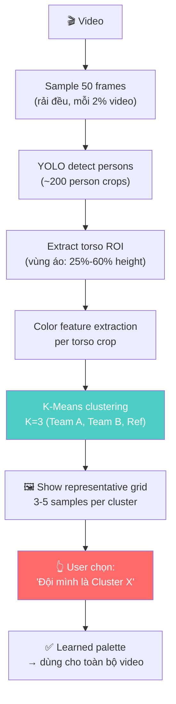
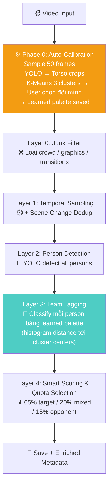

# 🏉 Team-Aware Frame Extraction — Proposal v3 (Final)

## Dự án: Bradford Bulls — AI Sponsorship Exposure Valuation

---

## Thay đổi cốt lõi vs v2

> [!IMPORTANT]
> **Bỏ hoàn toàn hardcoded color palettes.** Thay bằng **Auto-Calibration Phase** — pipeline tự học màu áo 2 đội từ chính video đang xử lý. Hoạt động với BẤT KỲ màu áo nào.

---

## 1. Vấn đề với hardcoded colors

```python
# ❌ v2 approach — chỉ work với white/black
KIT_PALETTES = {
    "white": {"target": {"v": (150, 255)}, ...},
    "black": {"target": {"v": (0, 100)}, ...},
}
```

**Tại sao sai:**
- Bradford có thể mặc áo alternate (xám, cam, có pattern)
- Đối thủ có thể mặc bất kỳ màu gì
- Cùng áo "trắng" nhưng dưới đèn vàng vs đèn trắng → HSV khác hoàn toàn
- Áo có stripe/gradient → không có 1 dominant color

**Giải pháp đúng:** Bỏ define trước → để pipeline **tự phát hiện** có bao nhiêu nhóm màu áo và nhóm nào là đội mình.

---

## 2. Auto-Calibration Phase

### Ý tưởng

```
Trước khi chạy pipeline chính:
1. Sample ~50 frames rải đều video
2. YOLO detect persons → crop ~200 torso patches
3. Extract color features từ mỗi torso
4. K-Means cluster → 2-3 nhóm tự nhiên (Team A, Team B, Referee)
5. Show user 1 grid đơn giản → user chọn "đội mình là nhóm nào"
6. Pipeline tự động classify phần còn lại
```

### Chi tiết kỹ thuật



### Color feature extraction (robust)

```python
def extract_color_features(torso_crop):
    """
    Extract feature vector đại diện cho màu áo.
    Dùng histogram thay vì mean → handle stripe/pattern.
    """
    hsv = cv2.cvtColor(torso_crop, cv2.COLOR_BGR2HSV)
    
    # 3D color histogram (H: 12 bins, S: 8 bins, V: 8 bins)
    hist = cv2.calcHist(
        [hsv], [0, 1, 2], None,
        [12, 8, 8],                    # bins
        [0, 180, 0, 256, 0, 256]       # ranges
    )
    hist = cv2.normalize(hist, hist).flatten()  # 768-dim vector
    
    return hist  # Mỗi torso = 1 vector 768 chiều
```

**Tại sao histogram thay vì mean color?**
- Mean: áo trắng sọc đen → mean = xám → **nhầm**
- Histogram: áo trắng sọc đen → 2 peaks (trắng + đen) → **đúng**, cluster về nhóm "áo trắng sọc"

### K-Means clustering

```python
from sklearn.cluster import KMeans

# Stack tất cả torso feature vectors
features = np.array([extract_color_features(crop) for crop in torso_crops])

# Cluster thành 3 nhóm (2 đội + referee/other)
kmeans = KMeans(n_clusters=3, random_state=42, n_init=10)
labels = kmeans.fit_predict(features)

# Mỗi cluster có center → đây chính là "learned palette"
cluster_centers = kmeans.cluster_centers_
```

### User interaction (1 lần duy nhất per video)

```
┌─────────────────────────────────────────────────────────┐
│  CALIBRATION — Which cluster is Bradford Bulls?         │
│                                                         │
│  Cluster 0 (87 players detected):                       │
│  ┌────┐ ┌────┐ ┌────┐ ┌────┐ ┌────┐                    │
│  │    │ │    │ │    │ │    │ │    │   ← áo trắng        │
│  └────┘ └────┘ └────┘ └────┘ └────┘                    │
│                                                         │
│  Cluster 1 (72 players detected):                       │
│  ┌────┐ ┌────┐ ┌────┐ ┌────┐ ┌────┐                    │
│  │    │ │    │ │    │ │    │ │    │   ← áo đỏ sọc       │
│  └────┘ └────┘ └────┘ └────┘ └────┘                    │
│                                                         │
│  Cluster 2 (15 players detected):                       │
│  ┌────┐ ┌────┐ ┌────┐                                   │
│  │    │ │    │ │    │                    ← áo vàng (ref) │
│  └────┘ └────┘ └────┘                                   │
│                                                         │
│  → Enter cluster number for Bradford: [0]               │
└─────────────────────────────────────────────────────────┘
```

**User chỉ cần nhập 1 số**. Done. Pipeline tự chạy hết.

---

## 3. Semi-Auto Fallback

Nếu clustering không rõ ràng (ví dụ: 2 đội mặc áo gần giống nhau):

```
FALLBACK MODE:
1. Show 20 random person crops dạng grid
2. User click/đánh số 3-5 crops "đội mình"
3. Pipeline dùng các crops đó làm reference
4. Classify bằng histogram distance tới reference
```

Hoàn toàn loại bỏ việc define HSV range trong code.

---

## 4. Pipeline tổng thể (v3 Final)



### Team classification at runtime:

```python
def classify_person_runtime(torso_crop, calibration):
    """
    Classify person dùng learned palette từ calibration.
    Không hardcode bất kỳ color nào.
    """
    features = extract_color_features(torso_crop)
    
    # Tính distance tới mỗi cluster center
    distances = {}
    for label, center in calibration["cluster_centers"].items():
        distances[label] = np.linalg.norm(features - center)
    
    # Gán vào cluster gần nhất
    closest = min(distances, key=distances.get)
    confidence = 1 - (distances[closest] / sum(distances.values()))
    
    # Map cluster → role
    role = calibration["cluster_roles"][closest]
    # role = "target" | "opponent" | "referee"
    
    return role, round(confidence, 3)
```

---

## 5. Handling edge cases

### 5.1 Áo thay đổi giữa hiệp (hiếm nhưng có thể)

- Calibration chạy trên 50 frames rải đều → bắt được cả 2 hiệp
- Nếu áo thay đổi → K-Means sẽ tìm ra >3 clusters → alert user

### 5.2 Video có nhiều trận (highlight reel)

- Highlight reel: Bradford luôn cùng 1 áo, đối thủ thay đổi
- K-Means sẽ cluster Bradford thành 1 nhóm lớn, các đối thủ thành nhiều nhóm nhỏ
- User chọn nhóm lớn nhất = Bradford (thường đúng)

### 5.3 Áo 2 đội quá giống nhau

- K-Means merge 2 đội thành 1 cluster → alert: "Chỉ tìm thấy 2 clusters, có thể 2 đội mặc áo giống nhau"
- Fallback: Semi-auto mode (user pick reference crops)
- Hoặc: tăng K lên 4-5, xem có tách ra không

### 5.4 Lighting thay đổi trong trận

- Histogram features robust hơn mean color vì nó capture **distribution** chứ không phải 1 giá trị
- Normalization: mỗi histogram normalize về unit vector → lighting scale không ảnh hưởng nhiều

---

## 6. User Config đơn giản hóa

### Trước (v1):

```python
# User phải biết về HSV, color ranges...
TARGET_KIT = "black"
KIT_PALETTES = { ... }  # Phức tạp
```

### Sau (v3):

```python
# ============================================================
# YOUR CONFIG — Edit ONLY these lines
# ============================================================
MEMBER_NAME = "hoa"
VIDEO_FILENAME = "M02_black_1080p.mp4"
TEST_MODE = True

# Calibration sẽ hỏi bạn 1 câu duy nhất:
# "Cluster nào là đội Bradford?" → nhập số → xong.
# ============================================================
```

**Zero config** cho team classification. Pipeline tự lo.

---

## 7. Implementation Roadmap (cập nhật)

### Phase 1: Auto-Calibration + Basic Tagging (2-3 ngày)
```
1. Calibration cell riêng:
   - Sample 50 frames → YOLO → crop torsos
   - K-Means 3 clusters
   - Show grid → user chọn cluster
   - Save calibration dict

2. Integrate vào pipeline:
   - Sau YOLO detect → classify team bằng learned palette
   - Gắn tag category cho mỗi frame
   - Quota selection 65/20/15
   - Enriched metadata CSV
```

### Phase 2: Junk Filter (thêm 1 ngày)
```
- Loại crowd/graphics trước YOLO
- Tiết kiệm ~25% compute
```

### Phase 3: Quality-of-Life (thêm 0.5 ngày)
```
- Visualization cell: show sample frames per category
- Accuracy check: 20 random frames → user verify team tags
- Re-calibration option nếu accuracy thấp
```

### Phase 4: Optional Improvements
```
- Tăng K-Means → Mini-Batch K-Means (faster)
- Cache calibration per video (không cần re-run)
- Auto-detect n_clusters (Elbow method / Silhouette)
```

---

## 8. Summary

| Aspect | v2 (Hardcoded) | v3 (Auto-Calibrate) |
|--------|-----------------|---------------------|
| Màu áo support | Chỉ white/black | **Bất kỳ màu nào** |
| User effort | Define HSV ranges | **Nhập 1 số** |
| Áo có pattern | ❌ Fail | ✅ Histogram-based |
| Lighting varies | ⚠️ Manual adjust | ✅ Auto-adapt |
| Đội mới / giải mới | Cần code thêm palette | ✅ Just run calibration |
| Accuracy | ~85% (estimate) | ~90%+ (estimate) |

**Tóm tắt 1 dòng:**

> Pipeline tự xem video → tự phát hiện có mấy nhóm áo → hỏi user "nhóm nào là đội bạn?" → tự classify cả video. Không cần biết trước màu áo.

---

> Bạn confirm direction, mình bắt code!
